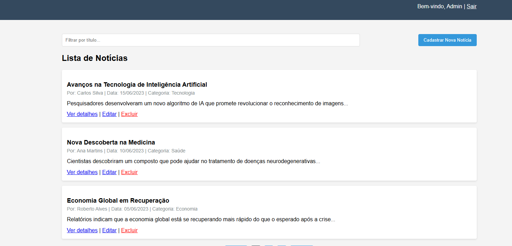

# Trabalho Prático 06 - Semanas 11 e 12

Nessa etapa, você irá evoluir o projeto anterior e montando um ambiente de desenvolvimento mais completo, típico de projetos profissionais. Nesse processo, vamos utilizar um **servidor backend simulado** com o JSON Server que fornece uma APIs RESTful a partir de um arquivo JSON.

Para esse projeto, além de mudarmos o JSON para o JSON Server, vamos permitir o cadastro e alteração de dados da entidade principal (CRUD).

## Informações do trabalho
- Nome: Thiago Nobre
- Matricula: 976584
- Proposta de projeto escolhida: site de notícias 
- Breve descrição sobre seu projeto: Portal de notícias com sistema de login e gerenciamento completo de conteúdo

## Capturas de Tela

### Tela de Login


### Listagem de Notícias


## Funcionalidades
- Sistema de login e autenticação
- Listagem de notícias com paginação
- Cadastro de novas notícias
- Visualização detalhada de notícias
- Edição de notícias existentes
- Exclusão de notícias

## Tecnologias Utilizadas
- HTML5
- CSS3
- JavaScript (ES6+)
- JSON Server

## Estrutura do Projeto
```
├── db/
│   ├── app.js         # Lógica de frontend e interação com a API
│   ├── db.json        # Banco de dados JSON
│   ├── detalhes.html  # Página de detalhes/edição de notícias
│   ├── index.html     # Página principal com login e listagem
│   └── styles.css     # Estilos do projeto
└── package.json       # Configuração do projeto
```

## Como Executar o Projeto

1. Certifique-se de ter o Node.js instalado
2. Instale as dependências:
   ```
   npm install
   ```
3. Inicie o servidor:
   ```
   npm start
   ```
   Ou alternativamente:
   ```
   json-server --watch db/db.json --port 3000 --static ./db
   ```
4. Acesse o sistema em: http://localhost:3000

## Credenciais de Acesso
- Email: admin@exemplo.com
- Senha: admin123


